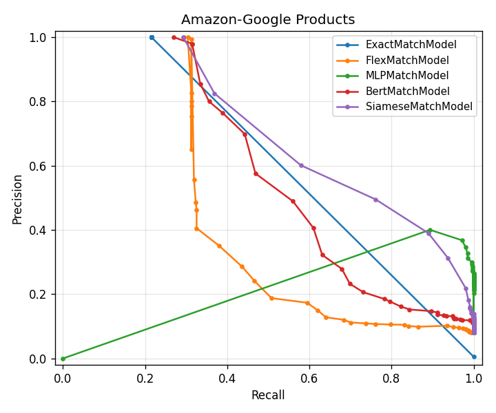
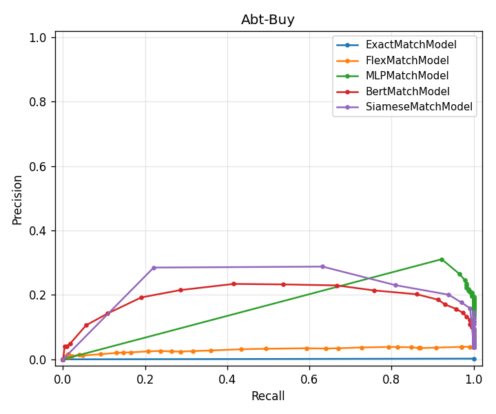
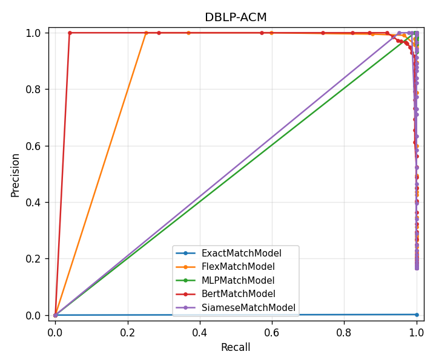
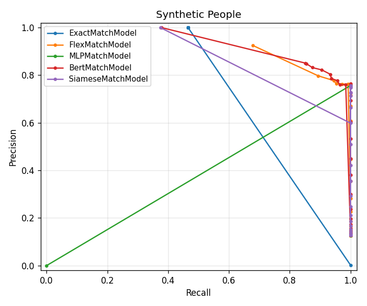

# matchify

A Python package for entity resolution (record linkage / deduplication) that
implements representative methods from major areas of the literature, evaluated
with mean reciprocal rank on standard benchmark datasets.

This repository is the artifact of an independent research project carried out
at Johns Hopkins University in Spring 2023 (course `EN.601.507: Applied Entity
Resolution & Deduplication`, advised by Dr. Tom Lippincott). It is archived on
Zenodo for citation; see `CITATION.cff` for the canonical citation.

## Overview

Entity resolution is the task of identifying records, across one or more
data sources, that refer to the same real-world entity. `matchify`
exposes a common abstract `ERBaseModel` interface and ships five
concrete models spanning the methodological progression in the field:

- `ExactMatchModel`: hash-based exact-match baseline. No training, no
  blocking, no field-aware logic. Useful as a lower bound and as a
  sanity check on a deduplicated dataset.
- `FlexMatchModel`: configurable, field-aware similarity model. Supports
  per-field type-aware normalization (`name`, `phone`, `address`,
  `date`), per-field comparison methods (Jaro-Winkler, Levenshtein,
  TF-IDF cosine, Jaccard), and blocking strategies (`prefix`,
  `sorted_neighborhood`, `block`, `full`). TF-IDF vectorizer is fit on
  the corpus in `train()`.
- `MLPMatchModel`: supervised MLP over a fixed feature vector of
  per-field similarity scores (Jaro-Winkler, Levenshtein, TF-IDF cosine,
  Jaccard). Training pairs are sampled 50/50 from the `group_id`
  supervision so the model learns which features matter per dataset
  instead of relying on a hand-tuned weighting.
- `BertMatchModel`: pretrained sentence-transformer encoder
  (`all-MiniLM-L6-v2` by default) over a concatenation of each record's
  configured fields. Encoder runs once, the embedding matrix is cached,
  and candidates are ranked by cosine similarity in embedding space.
  Needs `pip install matchify[deep]`.
- `SiameseMatchModel`: same encoder, fine-tuned with a contrastive loss
  on positive/negative pairs sampled from `group_id`. Twin-encoder
  architecture from the deep ER literature (Mudgal et al., DeepER). Same
  `[deep]` extra, same cosine-ranking path at inference.

Every model implements `mrr()`, `confusion_matrix(threshold)`, and
`threshold_sweep()` on the base class, so they can be compared
apples-to-apples on any labelled benchmark.

A small data-splitting utility (`DataSplitter`), a set of data loaders (CSV,
JSON, Parquet, S3, SQL), a synthetic person-record generator, and a CLI for
generating side-by-side model comparison tables round out the package.

## Results

MRR and confusion-matrix figures on the first 500 records of each bundled
benchmark, scored on every other record, with `--threshold 0.5` for the
confusion matrix:

### Amazon-Google Products (500 records)

| Model | MRR | Precision | Recall | F1 |
|---|---:|---:|---:|---:|
| ExactMatchModel | 0.280 | **1.000** | 0.215 | 0.354 |
| FlexMatchModel | 0.489 | 0.101 | 0.842 | 0.180 |
| MLPMatchModel | 0.610 | 0.250 | **1.000** | **0.400** |
| BertMatchModel | 0.604 | 0.124 | 0.952 | 0.220 |
| SiameseMatchModel | **0.649** | 0.095 | **1.000** | 0.174 |

### Abt-Buy (500 records)

| Model | MRR | Precision | Recall | F1 |
|---|---:|---:|---:|---:|
| ExactMatchModel | 0.000 | 0.000 | 0.000 | 0.000 |
| FlexMatchModel | 0.182 | 0.024 | 0.286 | 0.044 |
| MLPMatchModel | **0.758** | **0.182** | **1.000** | **0.307** |
| BertMatchModel | 0.571 | 0.068 | **1.000** | 0.128 |
| SiameseMatchModel | 0.652 | 0.040 | **1.000** | 0.077 |

### DBLP-ACM (500 records)

| Model | MRR | Precision | Recall | F1 |
|---|---:|---:|---:|---:|
| ExactMatchModel | 0.000 | 0.000 | 0.000 | 0.000 |
| FlexMatchModel | 0.924 | 0.313 | 1.000 | 0.477 |
| MLPMatchModel | **0.924** | **1.000** | **1.000** | **1.000** |
| BertMatchModel | 0.920 | 0.613 | 0.996 | 0.759 |
| SiameseMatchModel | **0.924** | 0.465 | **1.000** | 0.635 |

### Synthetic People (500 records)

A controlled benchmark generated by `matchify.utils.synthetic_data_generation.person_faker`:
50% unique, 20% exact duplicates, 20% close-matches (one perturbed
character/field), 10% close-non-matches. Exercises the type-aware
normalizers (`name`, `phone`, `address`, `date`).

| Model | MRR | Precision | Recall | F1 |
|---|---:|---:|---:|---:|
| ExactMatchModel | 0.392 | **1.000** | 0.465 | 0.635 |
| FlexMatchModel | 0.623 | 0.187 | **1.000** | 0.315 |
| MLPMatchModel | 0.625 | 0.757 | **1.000** | **0.861** |
| BertMatchModel | **0.629** | 0.133 | **1.000** | 0.235 |
| SiameseMatchModel | 0.626 | 0.421 | **1.000** | 0.592 |

The four trained models cluster tightly on MRR (~0.62-0.63), so on
this dataset the deciding factor is precision at threshold 0.5, and
the MLP comes out ahead. ExactMatchModel performs much better here
than on the other benchmarks because the synthetic generator does
produce perfect-duplicate records (~20% of the population). Its recall
is capped by the close-match population it can never catch.

Four stories in the data:

- **Loose-text data (Amazon-Google):** the methodological progression
  pays off. Each new tier (distance features, learned weighting (MLP),
  pretrained encoder (BERT), fine-tuned encoder (Siamese)) raises MRR.
  SiameseMatchModel wins on ranking by ~4 MRR points over BERT and ~4
  over MLP, because product descriptions reward an encoder that has
  *seen this dataset's positive/negative pairs*.
- **Cross-catalog text (Abt-Buy):** different vendors describe the
  same product in radically different language, so string-similarity
  alone (Flex) is a non-starter (MRR 0.18). MLP wins decisively
  (MRR 0.76) because its supervised feature head learns *which*
  similarity dimensions actually correlate with a match on this
  dataset. Pretrained BERT under-performs MLP here without
  fine-tuning. Siamese fine-tuning helps (0.65 vs 0.57 BERT) but
  doesn't catch up to the engineered-feature classifier on this
  small-vocabulary corpus.
- **Structured data (DBLP-ACM):** the title field is nearly deterministic
  so all four trained models converge on MRR 0.92. F1 separates
  them: MLPMatchModel's calibrated 0.5 threshold yields perfect
  classification (P=R=1.0); the cosine-similarity models rank the right
  candidates first but score too many adjacent records above 0.5 at
  inference time, hurting precision.
- **Controlled synthetic data:** the four trained models cluster on
  MRR (~0.62–0.63), so the engineered-feature MLP wins F1 by a wide
  margin (0.86 vs 0.59 next-best). Random one-character perturbations
  don't give the encoder anything systematic to learn, so Siamese
  fine-tuning underperforms its pretrained baseline on F1.

Caveat: F1 is reported at a fixed `threshold=0.5` for all models. The
cosine-similarity-based models (BERT, Siamese) would benefit from
per-dataset threshold tuning that this comparison doesn't perform.
The PR curves below show how each model trades off precision vs recall
across the full 0..1 threshold range, which is what makes the F1
comparison fair to inspect rather than to act on.

### Precision/recall curves

Generated by `make bench` (or `matchify model-comparisons --all
--limit 500 --pr-curves docs/pr/`). Each curve is one model swept
across thresholds 0..1 in 0.02 steps.

| | |
|:-:|:-:|
|  |  |
|  |  |

A few takeaways visible in the curves that the single-threshold
F1 column hides:

- **BertMatchModel owns the precision/recall trade on DBLP-ACM**:
  near-perfect precision out to recall ~0.95 before it collapses.
  The single-threshold F1 of 0.76 understates how good the ranking
  actually is.
- **The cosine-similarity models (BERT, Siamese) tend to win the
  high-recall band on the loose-text datasets** (Amazon-Google,
  Abt-Buy). Sliding past threshold 0.5 trades recall for a clean
  precision boost.
- **MLPMatchModel's curves are nearly linear** on every dataset
  except Amazon-Google. The classifier head produces bimodal
  probabilities (close to 0 or close to 1), so the threshold sweep
  mostly toggles "everything in" vs "everything out." That's why MLP
  hits P=R=F1=1.0 on DBLP-ACM at threshold 0.5 but doesn't dominate
  the curve elsewhere.
- **ExactMatchModel collapses to a single point or to (0, 0)** because
  it produces a binary score: either records hash to the same bucket
  or they don't, so the threshold sweep degenerates.

Reproduce with:

```bash
matchify model-comparisons --all --limit 500 --pr-curves docs/pr/
```

## Installation

```bash
git clone https://github.com/johnnysaldana/matchify.git
cd matchify
python3.12 -m venv .venv
source .venv/bin/activate
make install-deep    # base + torch + transformers (BERT, Siamese)
# or 'make install' for just the rules-based + MLP slice
```

Python 3.10-3.12 is supported. `gensim` does not yet build on 3.13+, pin
to 3.12 if you hit a `gensim` install error.

## Easiest path: try everything

```bash
make bench          # all 5 models on all 4 datasets, 500 rows each, ~5 min
make bench-quick    # same on 100 rows, ~1 min
```

Both write `output.html` with side-by-side predictions, MRR, and a
confusion matrix per (model, dataset) pair. `make bench` also dumps
per-dataset precision/recall PNGs to `docs/pr/`. Underneath it's just
`matchify model-comparisons --all --limit 500 --pr-curves docs/pr/`.
Use the CLI directly if you want to subset:

```bash
matchify model-comparisons \
  --dataset dblp-acm \
  --models flex --models mlp \
  --limit 200
```

## Quickstart

```python
import pandas as pd
from matchify import ExactMatchModel, FlexMatchModel
from matchify.models.mlp_match_model import MLPMatchModel

df = pd.read_csv('datasets/Amazon-GoogleProducts/CombinedProducts.csv')
ignored = ['id', 'group_id', 'original_id']

field_config = {
    'name':         {'type': 'other', 'comparison_method': 'jaro_winkler'},
    'description':  {'type': 'other', 'comparison_method': 'tfidf_cosine'},
    'manufacturer': {'type': 'other', 'comparison_method': 'jaro_winkler'},
    'price':        {'type': 'other', 'comparison_method': 'jaro_winkler'},
}
blocking_config = {'name': {'method': 'prefix', 'threshold': 2}}

emm = ExactMatchModel(df, ignored_columns=ignored)
print('Exact-match MRR:', emm.mrr())

fmm = FlexMatchModel(df, field_config=field_config,
                     blocking_config=blocking_config, ignored_columns=ignored)
fmm.train()
print('Flex-match MRR:', fmm.mrr())

mlp = MLPMatchModel(df, field_config=field_config,
                    blocking_config=blocking_config, ignored_columns=ignored)
mlp.train()
print('MLP MRR:', mlp.mrr())
print('MLP confusion @0.5:', mlp.confusion_matrix(threshold=0.5))

# Predict matches for a single lookup record
record = df.iloc[7].drop(labels=ignored)
print(mlp.predict(record).head(10))
```

To regenerate the model-comparison HTML report, run from the project root:

```bash
matchify model-comparisons --dataset amazon-google --dataset dblp-acm \
                           --models exact --models flex --models mlp
```

The output is written to `output.html`.

## Datasets

Three benchmarks from the [Leipzig DB-Group benchmark
collection](https://dbs.uni-leipzig.de/research/projects/object_matching/benchmark_datasets_for_entity_resolution)
ship with the repo, plus a synthetic person-record benchmark. Each follows
the same `Combined*.csv` layout: one row per record, with an `id`, the
original source-table identifier under `original_id`, and a `group_id`
for supervision (records with the same `group_id` are duplicates of one
another).

- `datasets/Amazon-GoogleProducts/`: e-commerce, ~3.7K records, fields:
  name, description, manufacturer, price.
- `datasets/Abt-Buy/`: e-commerce, ~2.2K records, same fields as
  Amazon-Google. Quickest of the real-world benchmarks.
- `datasets/DBLP-ACM/`: bibliographic, ~5K records, fields: title,
  authors, venue, year.
- `datasets/SyntheticPeople/`: synthetic person records (500),
  reproducible via `matchify.utils.synthetic_data_generation.person_faker`.
  The only bundled dataset that exercises the type-aware normalizers
  (`name`, `phone`, `address`, `date`) on `ERBaseModel`.

Each directory has a small notebook or README documenting how the combined
CSV was built from the upstream source tables.

## Repository layout

```
matchify/
├── matchify/
│   ├── models/
│   │   ├── base_model.py        # ERBaseModel + MRR + confusion_matrix
│   │   ├── exact_match_model.py
│   │   ├── flex_match_model.py
│   │   └── mlp_match_model.py
│   ├── pipelines/entity_resolution_pipeline.py
│   ├── utils/
│   │   ├── data_splitter.py
│   │   ├── data_loaders/        # csv, json, parquet, s3, sql
│   │   └── synthetic_data_generation/person_faker.py
│   ├── templates/table.html     # CLI report template
│   ├── datasets.py              # bundled-benchmark registry
│   └── cli.py
├── datasets/
│   ├── Amazon-GoogleProducts/
│   ├── Abt-Buy/
│   ├── DBLP-ACM/
│   └── SyntheticPeople/
├── docs/pr/                    # PR-curve PNGs per dataset
├── examples/                    # quickstart notebooks
├── tests/                       # pytest smoke tests
├── run.ipynb                    # original research notebook
├── CITATION.cff
├── .zenodo.json
├── PUBLISHING.md                # Zenodo release checklist
└── setup.py
```

## Reproducibility

Every result in the table above can be regenerated end-to-end on a 2023
laptop. The bundled CSVs are the exact files used to compute them. Pin
your Python to 3.10–3.12, install the project, then:

```bash
matchify model-comparisons --all --limit 500 --pr-curves docs/pr/
```

Total wall-clock on an M-series MacBook: ~5 min for all five models
across all four datasets, with the precision/recall sweep included.
Siamese fine-tuning dominates at ~80s on Amazon-Google, ~25s elsewhere.
Drop the deep models if you don't have the `[deep]` extra; the
rules-based + MLP slice finishes in well under a minute.

## Citation

If you use this software, please cite it. The canonical citation lives in
`CITATION.cff` and on the Zenodo record (DOI to be added on first release).

## License

MIT, see `LICENSE`.

## Acknowledgements

Advised by Dr. Tom Lippincott (Center for Language and Speech Processing,
Johns Hopkins University). The literature reading list, dataset survey, and
methodological framing draw on Christen's *Data Matching* (2012), Papadakis et
al.'s *The Four Generations of Entity Resolution* (2021), and the references
collected during the course; see `Entity Resolution Project EN.601.507/`
(local-only, not distributed) for the working bibliography.
